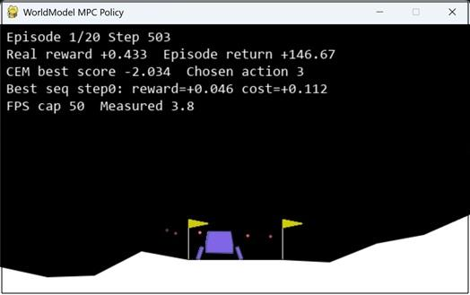

# LunarLander Policy Trained via Latent World Model (similar to RSSM in DreamerV2-V3)

Implementation of the latent world model similar to RSSM (DreamerV2-V3) for training the policy for LunarLander-V3 gymnasium simulation by using model-based reinforcement learning that uses the pretrained latent world model for offline neural rollouts. The repo also has a zero-shot learning MPC (model predictive control) based policy that uses the trained world model for rollouts to compute optimal actions. I also added a model-free RL policy (actor-critic) for comparisson. World model based approach are much more data efficient and use 120x LESS data compared to the model-free RL policy (uses gymnasium sim environment for rollouts during training). All 3 methods - MPC with world model policy, world model based RL policy and model-free RL policy reach similar performance during gymnasium sim testing (similar rewards). The repo also includes test code which can be used to evaluate if a trained world model checkpoint is fully trained and can support RL or MPC.



## Workflow

**World-model-based path** (model-based RL):

1. **Collect Dataset** → 2. **Train World Model** → 3. **Test World Model** → 4. **Train Actor-Critic (WM-based)** → 5. **Test Policy**

**Model-free path** (baseline comparison):

1. **Train Model-Free Actor-Critic** → 2. **Test Policy**

**MPC path** (no actor needed):

1. **Collect Dataset** → 2. **Train World Model** → 3. **WM MPC Policy (CEM)**

---

## 1. Collect Dataset

Collect human demonstrations or random episodes using keyboard control. Controls: LEFT/RIGHT/UP/DOWN arrows; ESC to end and save.

```bash
# Basic usage (saves to lunarlander_dataset.npz)
python collect_dataset.py

# Specify output path
python collect_dataset.py --dataset lunarlander_train_dataset.npz

# With custom seed for reproducibility
python collect_dataset.py --dataset lunarlander_train_dataset.npz --seed 12345
```

| Option | Default | Description |
|--------|---------|-------------|
| `--dataset` | `lunarlander_dataset.npz` | Output dataset .npz path |
| `--seed` | 0 | Base RNG seed for episode surfaces |

---

## 2. Replay Dataset

Replay recorded episodes in the LunarLander environment to verify the dataset.

```bash
# Replay 20 episodes (default)
python replay_dataset.py

# Replay with custom dataset and settings
python replay_dataset.py --dataset lunarlander_train_dataset.npz --episodes 50 --seed 12345

# Slower replay (0.1 seconds per step)
python replay_dataset.py --dataset lunarlander_train_dataset.npz --episodes 10 --sleep 0.1
```

| Option | Default | Description |
|--------|---------|-------------|
| `--dataset` | `lunarlander_dataset.npz` | Path to dataset .npz |
| `--episodes` | 20 | Number of episodes to replay |
| `--seed` | 0 | Random seed for selecting episodes |
| `--sleep` | 0.02 | Sleep between steps (seconds) |

---

## 3. Train World Model

Train the RSSM world model on sequences from real episodes. Uses `SequenceDataset` with teacher forcing.

```bash
# Basic usage (reads config.yaml, default datasets)
python train_models.py --phase world_model

# With explicit dataset paths
python train_models.py --phase world_model --config config.yaml \
    --train_dataset lunarlander_train_dataset.npz \
    --val_dataset lunarlander_val_dataset.npz
```

| Option | Default | Description |
|--------|---------|-------------|
| `--phase` | *(required)* | `world_model` or `actor_critic` |
| `--config` | `config.yaml` | Path to config file |
| `--train_dataset` | `lunarlander_train_dataset.npz` | Training dataset path |
| `--val_dataset` | `lunarlander_val_dataset.npz` | Validation dataset path |
| `--seed` | 12345 | Random seed for reproducibility |

Config is in `config.yaml`: `sequence_length`, `batch_size`, `lr`, `epochs`, etc.

---

## 4. Test World Model

Evaluate the trained world model. Modes: **teacher** (posterior reconstruction), **open** (prior rollout), **sim** (constant action rollout).

```bash
# Teacher mode (default): posterior reconstruction with GT actions
python test_worldmodel.py --mode teacher --max_episodes 5

# Open mode: prior rollout from first obs, compare to GT
python test_worldmodel.py --mode open --dataset lunarlander_val_dataset.npz --max_episodes 10

# Save plots and animations
python test_worldmodel.py --mode open --max_episodes 5 --plot_dir plots --animate

# Sim mode: constant action rollout
python test_worldmodel.py --mode sim --constant_action 0 --max_episodes 3

# Use specific checkpoint
python test_worldmodel.py --mode teacher --checkpoint world_model.pt --max_episodes 5
```

| Option | Default | Description |
|--------|---------|-------------|
| `--dataset` | `lunarlander_val_dataset.npz` | Validation dataset path |
| `--config` | `config.yaml` | Config file |
| `--checkpoint` | `world_model.pt` | World model checkpoint path |
| `--mode` | `teacher` | `teacher` / `open` / `sim` |
| `--max_episodes` | 5 | Episodes to evaluate |
| `--seed` | 0 | Seed for episode selection |
| `--plot_dir` | None | Save plots to directory |
| `--animate` | False | Save animations (.mp4) |
| `--constant_action` | 0 | Action id for sim mode |

---

## 5. Train Actor-Critic (WM-based)

Train the policy (actor) and value function (critic) via imagined rollouts in the world model's latent space. Requires a trained world model. This is the model-based RL approach.

```bash
# Basic usage
python train_models.py --phase actor_critic

# With explicit dataset path
python train_models.py --phase actor_critic --config config.yaml \
    --train_dataset lunarlander_train_dataset.npz
```

| Option | Default | Description |
|--------|---------|-------------|
| `--phase` | *(required)* | `actor_critic` |
| `--config` | `config.yaml` | Path to config file |
| `--train_dataset` | `lunarlander_train_dataset.npz` | Training dataset path |

Config: `horizon`, `past_horizon`, `future_horizon` (must satisfy P+F=H), `batch_size`, `lr`, `epochs`, etc.

---

## 6. Test Policy

Run a trained policy in the LunarLander environment. Supports both WM-based (latent) and model-free (obs) actors.

```bash
# Test WM-based actor (requires world model + latent actor)
python test_policy.py --actor_type latent --world_model world_model.pt --actor actor.pt --episodes 20

# Test model-free actor (no world model needed)
python test_policy.py --actor_type obs --actor checkpoints/actor_mf_20260324_230139_epoch_750.pt --episodes 20

# Stochastic action sampling instead of deterministic argmax
python test_policy.py --actor_type obs --actor checkpoints/actor_mf_20260324_230139_epoch_750.pt --stochastic
```

| Option | Default | Description |
|--------|---------|-------------|
| `--actor_type` | `latent` | `latent` (WM-based, uses RSSM) or `obs` (model-free, raw observations) |
| `--config` | `config.yaml` | Config for model dimensions |
| `--world_model` | `world_model.pt` | World model checkpoint (only for `latent` actor) |
| `--actor` | `actor.pt` / `actor_mf.pt` | Actor checkpoint (default depends on `--actor_type`) |
| `--episodes` | 20 | Number of episodes to run |
| `--max_steps` | 600 | Max steps per episode |
| `--deterministic` | *(default)* | Use argmax action selection |
| `--stochastic` | | Sample actions from the policy distribution |
| `--seed` | 12345 | Random seed for reproducibility |

---

## 7. WM MPC Policy (CEM Planner)

Run model-predictive control directly in Gymnasium using the world model only (no actor network).
At each step it plans over discrete action sequences with CEM, executes the best first action, then replans.

```bash
# Basic run (with render)
python wm_mpc_policy.py --config config.yaml --world_model world_model.pt --render

# Faster/no-render run
python wm_mpc_policy.py --config config.yaml --world_model world_model.pt --episodes 10
```

Keyboard controls (render window):
- `R`: toggle render on/off
- `Q` or `ESC`: quit

Useful knobs:
- `--horizon`, `--population`, `--elites`, `--cem_iters` for planner strength/speed
- `--w_angle`, `--w_ang_vel`, `--w_vx`, `--w_vy_down` for landing objective weights

---

## 8. Train Model-Free Actor-Critic (Baseline)

Train a policy directly from on-policy environment interactions without a world model. Uses the same A2C algorithm (GAE, entropy regularization) as the WM-based trainer, but operates on raw observations instead of latent states. Serves as a baseline for comparing sample efficiency and compute cost against the world-model-based approach.

```bash
# Train from scratch
python train_modelfree_actorcritic.py --seed 12345

# Resume from latest checkpoint
python train_modelfree_actorcritic.py --resume --seed 12345

# Train with rendering (slower, shows one episode per epoch)
python train_modelfree_actorcritic.py --render --seed 12345
```

| Option | Default | Description |
|--------|---------|-------------|
| `--epochs` | 1000 | Number of training epochs |
| `--episodes_per_epoch` | 50 | On-policy episodes collected per epoch |
| `--max_steps` | 600 | Max steps per episode |
| `--lr` | 3e-4 | Learning rate (AdamW) |
| `--gamma` | 0.99 | Discount factor |
| `--lambda_gae` | 0.95 | GAE lambda |
| `--entropy_coeff` | 0.2 | Initial entropy coefficient |
| `--entropy_coeff_end` | 0.01 | Final entropy coefficient (linearly decayed) |
| `--hidden_dim` | 256 | Hidden dim for ActorObs / CriticObs |
| `--checkpoint_freq` | 10 | Save checkpoints every N epochs |
| `--resume` | | Resume from latest `actor_mf` / `critic_mf` checkpoint pair |
| `--render` | | Render one episode per epoch |
| `--seed` | 12345 | Random seed |

Checkpoints are saved as `actor_mf_<date>_<time>_epoch_<N>.pt` and `critic_mf_<date>_<time>_epoch_<N>.pt`. Training logs are written to `train_modelfree_actorcritic_logs.txt`.

---

## Sample Files (Checked In)

The repository includes sample datasets and trained checkpoints:

| File | Description |
|------|--------------|
| `lunarlander_train_dataset.npz` | Training dataset (750 episodes) |
| `lunarlander_val_dataset.npz` | Validation dataset (122 episodes) |
| `world_model.pt` | Pretrained world model checkpoint (epoch 200) |
| `actor.pt` | WM-based actor checkpoint (epoch 750) |
| `critic.pt` | WM-based critic checkpoint (epoch 750) |
| `actor_mf.pt` | Model-free actor checkpoint (best, epoch 750) |
| `critic_mf.pt` | Model-free critic checkpoint (epoch 750) |

Use `--checkpoint world_model.pt` when testing the world model.


## Quick Reference

```bash
# World-model-based pipeline
python collect_dataset.py --dataset lunarlander_train_dataset.npz --seed 12345
python replay_dataset.py --dataset lunarlander_train_dataset.npz --episodes 5

python train_models.py --phase world_model --train_dataset lunarlander_train_dataset.npz --val_dataset lunarlander_val_dataset.npz
python test_worldmodel.py --mode open --max_episodes 2 --plot_dir plots

python train_models.py --phase actor_critic --train_dataset lunarlander_train_dataset.npz
python test_policy.py --actor_type latent --world_model world_model.pt --actor actor.pt --episodes 20

# MPC (no actor needed, uses world model directly)
python wm_mpc_policy.py --config config.yaml --world_model world_model.pt --render --episodes 20

# Model-free baseline
python train_modelfree_actorcritic.py --seed 12345
python test_policy.py --actor_type obs --actor checkpoints/actor_mf.pt --episodes 20
```

---

## Notes on important details that make this version working

- **Decoder design to multi-head outputs**:
  - Shared decoder backbone from `[h, z]`
  - Physics head (6 continuous dims: `x, y, vx, vy, angle, ang_vel`)
  - Contact head (2 binary dims: leg contacts)
  - Done head (1 binary dim)
- **Loss design to match output types**:
  - Physics: MSE
  - Contact: BCE-with-logits
  - Done: BCE-with-logits
  - (plus existing reward and KL terms)
- **Model design**:
  - `Linear -> LayerNorm -> SiLU` are good setup for physics modelling
- **Posterior design**:
  - Posterior uses `obs_t` only, while `done` is a training target (predicted).

### Why these choices matter

- The main gain comes from **separating continuous and binary prediction heads/losses**, which reduced blurry terminal/contact dynamics and improved landing quality under MPC optimizer.
- Capacity, normalization (LinearNorm) and activation (SiLU) changes further improve optimization stability. 

### Checkpoint selection notes

- In training logs, the most informative metrics for MPC checkpoint ranking were:
  - **validation loss (`val_loss`)**
  - **reward RMSE (`reward_rmse`)**
- Metrics like best late-stage observation RMSE alone were less predictive of MPC closed-loop quality.
MAE metrics were not that informative since they don't account for outliers as well as RMSE metrics.

### Checkpoints in the repo

- WorldModel checkpoint (`world_model.pt`) is for epoch 200
- WM-based AC policy checkpoints (`actor.pt` and `critic.pt`) are for epoch 750
- Model-free AC policy checkpoints (`actor_mf_*_epoch_750.pt` and `critic_mf_*_epoch_750.pt`) are for epoch 750 (best model-free checkpoint)
- Also the repo has a `world_model_random.pt` checkpoint with random weights to compare with and a also poorly trained AC policy in `actor_earlyBad_ep50.pt` to test
